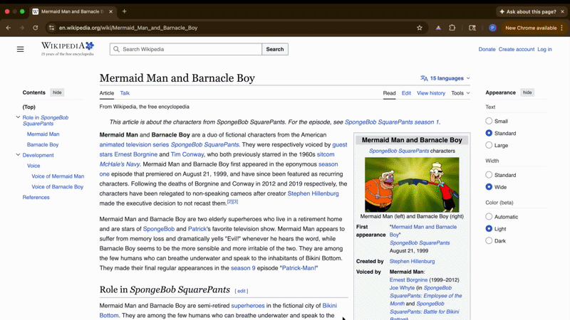
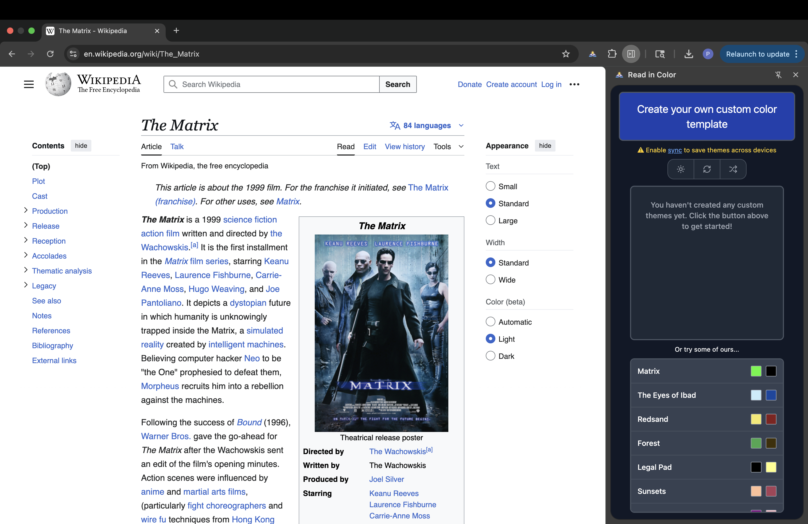
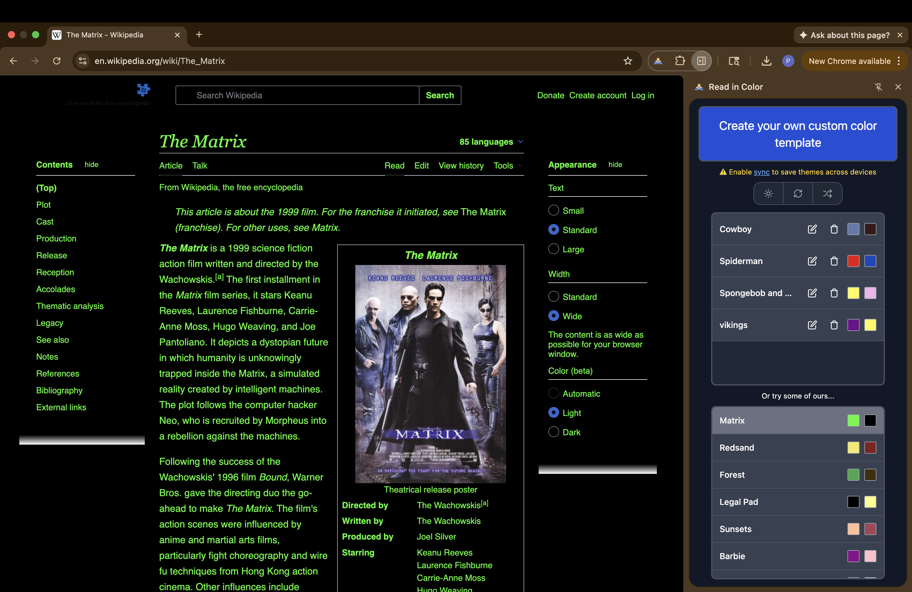

<div align="center">


# Read in Color

**Personalized reading themes for the web — synced across your Chrome profile.**

[](https://chromewebstore.google.com/detail/read-in-color/hchagbfeiackcjbhhjlhebmbhfolncni)
[](LICENSE)
[](https://www.typescriptlang.org/)
[](https://docs.plasmo.com/)

[**→ Install from the Chrome Web Store**](https://chromewebstore.google.com/detail/read-in-color/hchagbfeiackcjbhhjlhebmbhfolncni)

---



</div>

---

## What It Does

Read in Color is a Chrome extension that lets you apply custom color themes — background and text — to any content-heavy webpage. Open the side panel, pick a theme, and the page transforms instantly. Your themes follow you across every device signed into your Google Chrome profile.

It's built for people who find the web's default white-on-black reading experience uncomfortable — whether due to eye strain, light sensitivity, or simply preferring a warmer, more personalized environment. It works best on content-rich sites like Wikipedia, news articles, and blogs.

---

## Features

- **Custom theme creation** — define any background color and text color combination and save it with a name
- **Built-in presets** — sensible defaults available immediately, even without signing in  
- **Cross-device sync** — themes are stored via `chrome.storage.sync`, so they persist across every Chrome session tied to your Google profile
- **Side panel UI** — non-intrusive panel that sits alongside your content without taking over the page
- **Live injection** — color changes apply to the active tab in real time, no reload required
- **Guest-friendly** — presets are accessible to anyone; sign in to unlock theme creation and sync

---

## Demo

| Default Page | With Theme Applied |
|---|---|
|  |  |

---

## Tech Stack

| Layer | Technology |
|---|---|
| Framework | [Plasmo](https://docs.plasmo.com/) — Chrome extension framework with hot reload |
| Language | TypeScript |
| UI | React + [Tailwind CSS](https://tailwindcss.com/) |
| Auth | Google OAuth via Chrome Identity API |
| Storage & Sync | `chrome.storage.sync` — persists themes to the user's Chrome profile |
| Style Injection | Chrome Content Scripts + `chrome.scripting` API |
| Side Panel | Chrome Side Panel API (Manifest V3) |
| CI/CD | GitHub Actions + [BPP](https://bpp.browser.market/) for automated store deployment |

---

## How It Works

1. The extension registers a **side panel** that opens alongside any active tab
2. When a user applies a theme, a **content script** is injected into the page that traverses the DOM and overrides background and text color CSS properties
3. Theme data (name, background hex, text hex) is written to **`chrome.storage.sync`**, which Chrome automatically replicates across all devices signed into the same Google profile
4. On extension load, themes are read from storage and rendered in the panel — no backend, no server, no network requests required

---

## Installation

### From the Chrome Web Store *(recommended)*

[**→ Install Read in Color**](https://chromewebstore.google.com/detail/read-in-color/hchagbfeiackcjbhhjlhebmbhfolncni)

After installing, click the puzzle piece icon in your toolbar, pin the extension, then open it in the side panel on any article or news page.

### Local Development

**Prerequisites:** Node.js 18+, pnpm

```bash
# Clone the repository
git clone https://github.com/paul-io/read-in-color.git
cd read-in-color

# Install dependencies
pnpm install

# Start the dev server with hot reload
pnpm dev
```

Then load the unpacked extension in Chrome:
1. Navigate to `chrome://extensions`
2. Enable **Developer Mode** (top right)
3. Click **Load unpacked** and select `build/chrome-mv3-dev`

### Production Build

```bash
pnpm build
```

The production bundle will be in `build/chrome-mv3-prod`, ready to zip and submit to the Chrome Web Store.

---


## Project Structure

```
read-in-color/
├── src/
│   ├── sidepanel.tsx              # Extension side panel entry point
│   ├── App.tsx                    # Root React component
│   ├── authContext.tsx            # Google OAuth context provider
│   ├── background.ts              # Service worker — side panel registration
│   ├── types.ts                   # Shared TypeScript types
│   ├── style.css                  # Global styles
│   ├── components/
│   │   ├── CustomList.tsx         # List of user-created themes
│   │   ├── PresetList.tsx         # List of built-in preset themes
│   │   ├── PreviewCustom.tsx      # Live preview for custom themes
│   │   ├── PreviewPreset.tsx      # Live preview for preset themes
│   │   └── ThemeControls.tsx      # Color picker and theme controls
│   ├── constants/
│   │   └── presets.ts             # Built-in preset theme definitions
│   ├── contents/
│   │   └── changeColors.tsx       # Content script — DOM color injection
│   ├── hooks/
│   │   └── useUserPreferences.ts  # Hook for reading/writing chrome.storage.sync
│   ├── modals/
│   │   └── ThemeModal.tsx         # Create/edit theme modal
│   ├── pages/
│   │   ├── UserPage.tsx           # Authenticated user view
│   │   └── GuestPage.tsx          # Unauthenticated guest view (presets only)
│   └── utils/
│       ├── auth.ts                # OAuth helpers
│       ├── presetUtils.ts         # Preset theme utilities
│       └── themeStorage.ts        # chrome.storage.sync read/write helpers
├── assets/                        # Extension icons and static assets
├── docs/                          # Screenshots and GIFs used in the README
├── .github/workflows/             # CI/CD — automated build and store submission
├── tailwind.config.js
├── tsconfig.json
└── package.json
```

---

## Next Features

- [ ] Per-site theme memory (automatically apply a saved theme on specific domains)
- [ ] Font size and font family controls
- [ ] Export / import themes as JSON
- [ ] Firefox support via Plasmo's cross-browser build

---

## Privacy

Read in Color does not collect, transmit, or sell any user data. All theme data lives exclusively in your browser via `chrome.storage.sync`. See the full [Privacy Policy](privacy-policy.html).

---

## License

MIT © [Paul](https://github.com/paul-io)